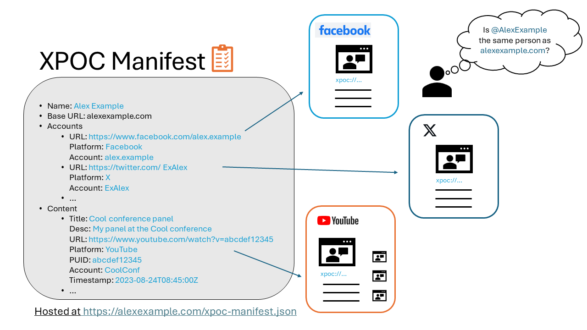
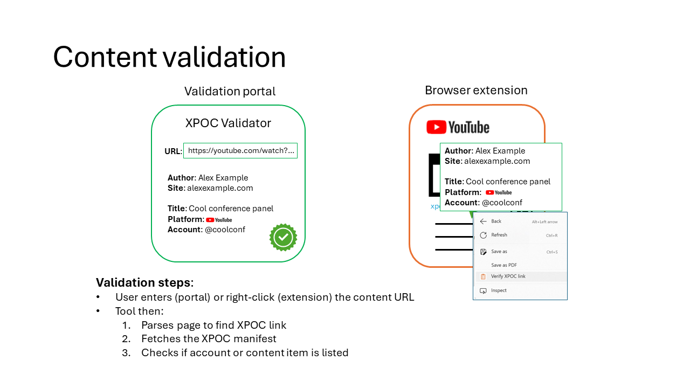

# Cross-Platform Origin of Content (XPOC) Framework

_This is a pre-release preview of the framework, currently at version 0.1.1. The specification and sample implementations might change significantly as we continue its development and receive feedback._

This project introduces the Cross-Platform Origin of Content (XPOC) framework, along with a sample implementation.

The aim of the XPOC framework is to allow a person or organization (content owner) to create a authoritative list of

1. the various accounts they control over hosting web platforms (such as YouTube, X (formerly Twitter), Facebook, etc.), and
2. the various pieces of content (videos, posts, etc.) they created or approved on these platforms.

Using this framework, content creators protect themselves against falsely attributed accounts or content, providing signals that can be used by automated validation tools.

A content owner creates a XPOC manifest that contains references to the accounts they control and the content items they created, participated in, or authorized across various platforms, and hosts it on its well-known website. The owner then adds a XPOC URI referencing its own manifest to their platform account pages (bio or profile) and content items. Verifiers can validate the origin of an account or content item by inspecting the content owner's manifest (if known) or by using a XPOC URI, dereferencing it to retrieve the owner's manifest, and verifying that the account or content item is listed within it. For details, see the framework's [specification](./doc//xpoc-specification.md) and the [FAQ](./doc/FAQ.md).

The repository contains [sample implementations](#sample-implementations) to create XPOC manifests and to verify XPOC content.

## System overview

This section describes the life cycle for data protected using the Cross-Platform Origin of Content framework. The following diagram illustrates the [example](./doc/xpoc-specification.md#example) from the specification.

1. A content owner (Alex Example) creates a XPOC manifest on their website (`alexexample.com`) listing the accounts they control and the content they've created or approved across different platforms (e.g., YouTube, Facebook, X/Twitter).

2. The content owner adds a XPOC URI (`xpoc://alexexample.com!`) to each referenced content item (e.g., in the YouTube video description, in the Facebook post).

3. A verifier can discover a content owner's associated accounts and content by inspecting their manifest.

4. A verifier looking at the content item parses the XPOC URI, fetches the corresponding XPOC manifest, and verifies that the content item is indeed listed therein.

## Sample implementations

The project contains the following sample implementations for the framework (refer to their respective `README.md` for details on how to use them):

-   A client-side HTML portal to create XPOC manifests and verify XPOC resources ([README](./samples/client-side-html/README.md))
-   A Chrome/Edge browser extension to verify XPOC URIs ([README](./samples/browser-extension/README.md))

_Note_: we are working on other implementations, including a reference TypeScript library, and a server-side portal. See the project's active branches for work-in-progress implementations.

## Open questions

We are seeking feedback on the following open questions:

-   Should the XPOC manifest live in the Origin's website root directory (as currently specified) or in a `/.well-known` directory (as specified in [RFC 5785](https://datatracker.ietf.org/doc/html/rfc5785)). The current approaches is simpler, but using a well-known folder follows a pattern used by many web discovery protocols and might provide organizational benefits.
-   Should the linked accounts and content items be listed in the same manifest (as currently specified), or listed in two different ones? Presumably, the linked account list will not change very often while the content item list would grow frequently. Should a different URI prefixes be used for these two different data types? This would facilitate the validation tools implementation, at the expense of a slightly more complicated specification.

## Contributing

This project welcomes contributions and suggestions. Most contributions require you to agree to a
Contributor License Agreement (CLA) declaring that you have the right to, and actually do, grant us
the rights to use your contribution. For details, visit https://cla.opensource.microsoft.com.

When you submit a pull request, a CLA bot will automatically determine whether you need to provide
a CLA and decorate the PR appropriately (e.g., status check, comment). Simply follow the instructions
provided by the bot. You will only need to do this once across all repos using our CLA.

This project has adopted the [Microsoft Open Source Code of Conduct](https://opensource.microsoft.com/codeofconduct/).
For more information see the [Code of Conduct FAQ](https://opensource.microsoft.com/codeofconduct/faq/) or
contact [opencode@microsoft.com](mailto:opencode@microsoft.com) with any additional questions or comments.

## Trademarks

This project may contain trademarks or logos for projects, products, or services. Authorized use of Microsoft
trademarks or logos is subject to and must follow
[Microsoft's Trademark & Brand Guidelines](https://www.microsoft.com/en-us/legal/intellectualproperty/trademarks/usage/general).
Use of Microsoft trademarks or logos in modified versions of this project must not cause confusion or imply Microsoft sponsorship.
Any use of third-party trademarks or logos are subject to those third-party's policies.
